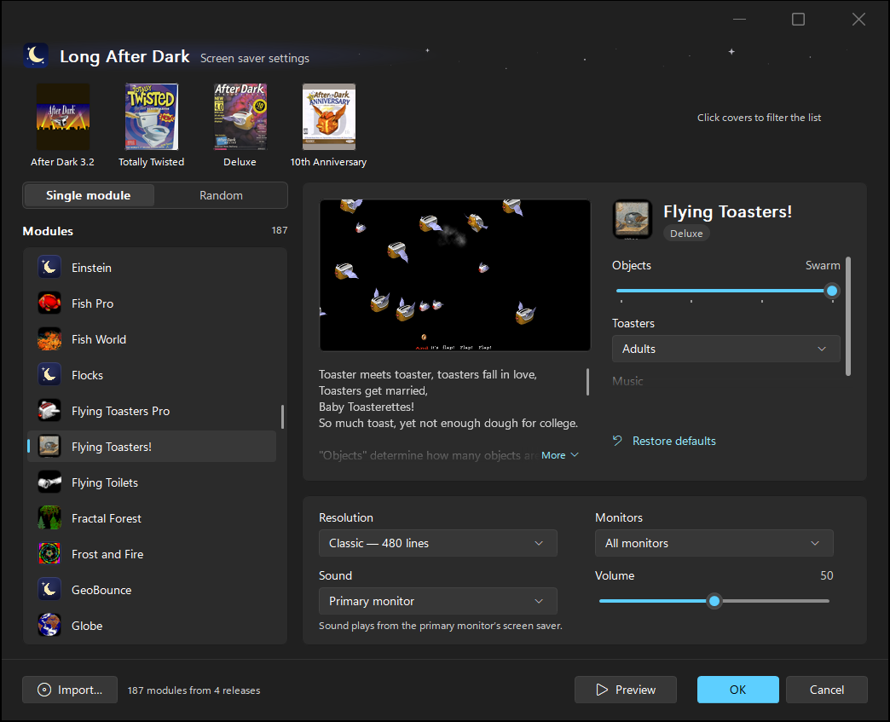
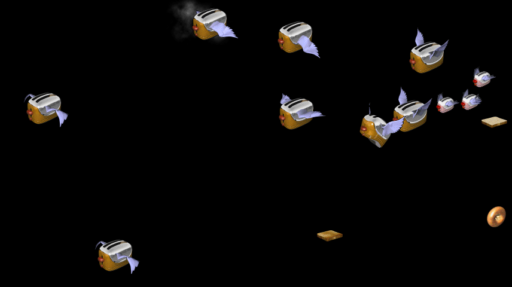
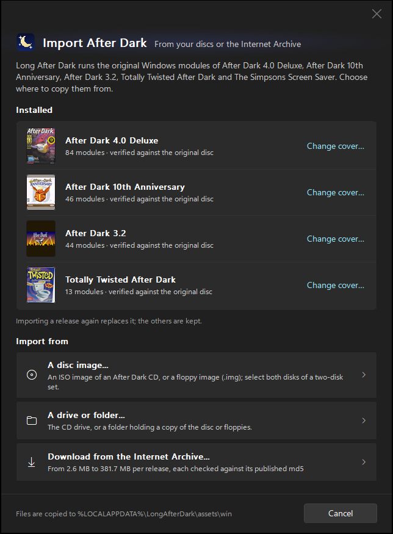
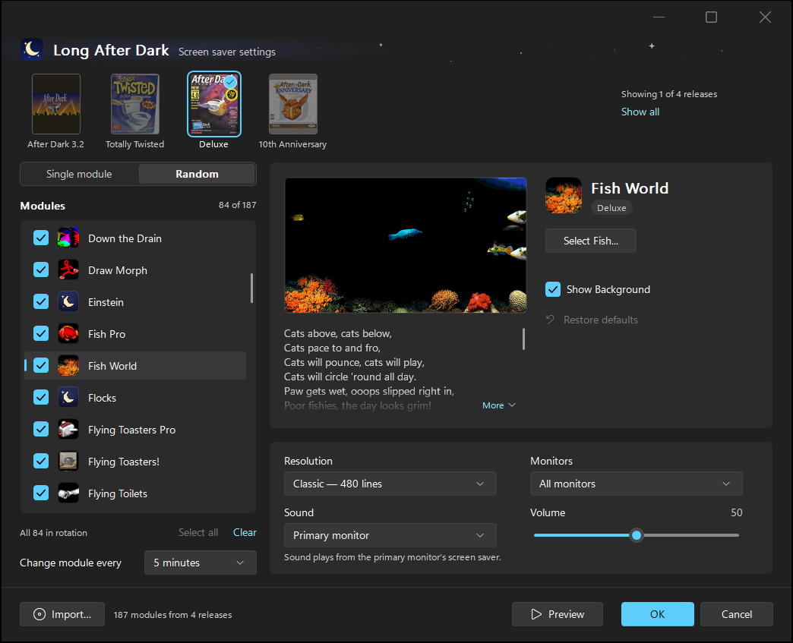

# Long After Dark

The original After Dark screen savers, Flying Toasters and all, running on
today's Windows.



## What it is

Long After Dark brings back Berkeley Systems' After Dark screen savers from
the 1990s. It doesn't remake them. It runs the original modules, unchanged,
on an emulated PC of the time: the x86 processor and the parts of Windows 95
they talk to. So they look, move and sound the way they did.

It works with five After Dark releases for Windows. Import one or all of
them; each works on its own.

| Release | Year | Modules |
|---|---|---|
| The Simpsons Screen Saver | 1994 | 15 |
| After Dark 3.2 | 1995 | 44 |
| Totally Twisted After Dark | 1995 | 13 |
| After Dark 4.0 Deluxe | 1996 | 84 |
| After Dark 10th Anniversary | 1999 | 46 |

- **Every monitor.** It runs on all your monitors, or only the main one.
- **Sound.** The modules' sound effects and music, and the Simpsons'
  voices, with a volume setting (or off).
- **Games.** Caps Lock starts the games built into some modules, such as
  Rodger Dodger and You Bet Your Head, without closing the screen saver.
- **The modules' own options.** Each module's sliders and choices, and
  buttons such as Fish World's **Select Fish…** that open the module's
  original settings windows.
- **A modern settings window.** It follows Windows' light or dark mode,
  shows each release's box cover, and has a live preview.



## What you need

- **A 64-bit Windows or Linux PC** with an x64 (Intel or AMD) processor.
  On Linux, 64-bit Wine and X11 libraries are required to run the original modules
  (see [docs/LINUX.md](docs/LINUX.md)).
- **After Dark itself.** It isn't included, and you're responsible for
  sourcing it legally. The importer copies it from any of these:
  - your After Dark CD, or a folder copied from it;
  - a disc or floppy image (`.iso`, `.bin`, `.img`, `.ima`, `.vfd` or
    `.flp`), or a `.zip` of the install files. For the Simpsons' two
    floppies, choose both images;
  - the Internet Archive. The importer can download each release for you:
    a CD image of 381.7 MB (4.0 Deluxe), 143.3 MB (10th Anniversary),
    58.8 MB (3.2) or 37.9 MB (Totally Twisted), or the Simpsons' install
    files (2.6 MB).

Every import is checked, file by file, against the original release, so you
know you have the real thing.

## Getting started

1. **Get the programs.** Download `LongAfterDark-<version>-x64.zip` from the
   [latest release](https://github.com/starrlord/longafterdark/releases/latest)
   and unzip it anywhere, or build it from source (see
   [Building from source](#building-from-source)). The programs aren't
   code-signed yet, so Windows may warn that they come from an unknown
   publisher: click **More info**, then **Run anyway**. It is three
   programs, which must stay together in one folder:
   - `LongAfterDark.scr`: the screen saver and its settings window;
   - `adhostwin.exe`: the emulator that runs the modules;
   - `adimport.exe`: the importer.
2. **Import After Dark.** Double-click `adimport.exe` (or click **Import…**
   in the screen saver's settings window) and choose where to copy from: a
   disc image, a drive or folder, or a download from the Internet Archive.
   Import as many releases as you like. Each one is added beside the ones
   you already have.

   

3. **Install the screen saver.** Right-click `LongAfterDark.scr` and choose
   **Install** (on Windows 11 you may need **Show more options** first).
   Windows makes it your screen saver and opens Screen Saver Settings, so
   leave the folder where it is. To install it for every user of the PC
   instead, copy the three programs to `C:\Windows\System32` and choose
   **Long After Dark** in Screen Saver Settings.
4. **Choose what it shows.** Click **Settings…** in Screen Saver Settings
   (Windows Settings → Personalization → Lock screen → Screen saver), or
   right-click `LongAfterDark.scr` and choose **Configure**. Pick a single
   module, or **Random** and the modules to rotate through and how often.
   You can also set the resolution, the monitors and the sound. The live
   preview shows the selected module with your settings, and **Preview**
   runs it full screen.

## Tips

- **Filter by release.** Click box covers to list only those releases'
  modules, and click again to undo. With none selected, all of them are
  listed. Right-click a cover to use your own picture for it.

  

- **Caps Lock never closes the screen saver.** In some modules it does
  something, like scaring the fish, or starts a game (Rodger Dodger, Lunatic
  Fringe, You Bet Your Head, Simpsons Trivia and others). While a game is
  on, the keys and the mouse belong to it. Press Caps Lock again to stop
  playing, or Alt to close the screen saver at once. Otherwise most keys, a
  click or moving the mouse close it.
- **Module buttons** such as **Select Fish…** open the module's original
  options window. What you choose there is saved straight away, and
  **Cancel** in the settings window doesn't undo it.
- **Sound** plays only from the main monitor's screen saver. The small live
  preview is always silent.
- **Your files** are all in `%LOCALAPPDATA%\LongAfterDark` (paste that into
  File Explorer's address bar): the imported releases, downloads, your
  settings and what the modules save themselves, such as message texts and
  high scores.

## Status

Long After Dark is new. It has no installer or code signing yet, and not
every module's speed has been compared with the original.

## Building from source

You need [CMake](https://cmake.org/) 3.24 or later. Everything else, the compiler
included, is downloaded into `third_party/` and nothing is installed
system-wide.
- **On Windows**: Git for Windows (Git Bash).
- **On Linux**: bash, g++, and X11 development libraries (`sudo apt install wine wine64 libx11-dev libxext-dev`).

From the repository folder:

```bash
bash tools/bootstrap.sh   # once: fetches the compiler and libraries into third_party/
bash tools/package.sh     # builds the programs into build/dist/LongAfterDark/
```

[docs/BUILDING.md](docs/BUILDING.md) covers the rest: how the pieces fit
together, the tests, and running a module without the screen saver.
For Linux-specific instructions, see [docs/LINUX.md](docs/LINUX.md).

## Documentation

- [docs/LINUX.md](docs/LINUX.md): running and configuring Long After Dark on Linux
  (standalone player and XScreenSaver integration).
- [docs/INSTALL.md](docs/INSTALL.md): installing and using Long After Dark
  in detail, including the importer's command line.
- [docs/BUILDING.md](docs/BUILDING.md): building, testing and the source
  tree.
- [docs/DESIGN.md](docs/DESIGN.md): how the emulation works.
- [docs/PACKAGES.md](docs/PACKAGES.md): the five releases and how each one
  is imported.

## License

Long After Dark's own code is under the license in [LICENSE](LICENSE).
[THIRD_PARTY_LICENSES.md](THIRD_PARTY_LICENSES.md) lists the third-party
code built into the programs, including the x86 emulator, which is derived
from [resource_dasm](https://github.com/fuzziqersoftware/resource_dasm).

After Dark, its modules, pictures, music and box art belong to their rights
holders. None of their files are in this repository or in the programs it
builds: you import your own copies.
